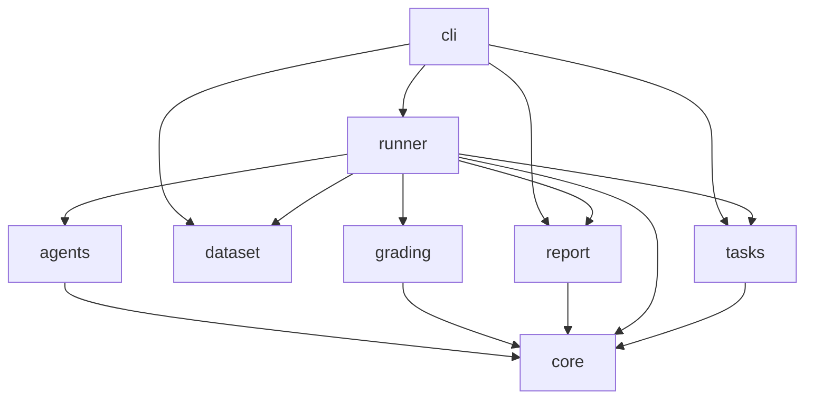

# slayer_evals

## Purpose and context

A capability benchmark for agents answering analytics questions over a seeded demo database: it measures whether an
agent given SLayer's MCP server reaches for SLayer's DSL (partitioned aggregates, transforms, multi-stage queries, …)
rather than pulling raw rows and post-processing them, and how it compares with an agent given direct SQL access,
including on traps where naive SQL silently returns wrong numbers. Each trial is graded on correctness and on whether
a single query's own result is the answer. Any agent can be benchmarked through one adapter.

## Building blocks

<!-- likec4:python -->

<!-- /likec4:python -->

## Principles

1. Pure grading: a verdict is a function of the task, its truth, the submission and the trace; grading does no I/O
   and imports only `core`. [enforced: arch_check:model-truth]
2. Blind agents: an agent receives only the prompt text, its profile and the trial environment.
   [enforced: test:tests/test_runner.py]
3. Agent-agnostic: nothing outside `agents` reads agent SDK objects. [enforced: arch_check:model-truth]
4. Hermetic sessions: a session loads exactly its profile's MCP servers, with sanitized subprocess environments.
   [enforced: test:tests/test_agent_options.py]
5. Reproducible data: the same seed yields the same tables, and truth comes from the built database, never typed by
   hand. [enforced: test:tests/test_dataset.py]
6. Fix the surface, not the eval: prompts stay generic and capability-neutral. [review]
7. Proven tasks: every task has a single SLayer query that answers it, and every trap a naive SQL query that misses it.
   [enforced: test:tests/test_task_proofs.py]

## Rationale

The only seam between an agent and its score is `core`'s submission and trace, so `grading`, `agents` and `report`
never import one another; that keeps agents blind to what is graded and lets any agent plug in. Failures are meant
to be fixed in SLayer's MCP surface, which is why task prompts and the system prompt carry no capability hints.
The shape comes from the openspec change `dev-2055-slayer-evals-capability-benchmark-do-agents-actually-reach`.
